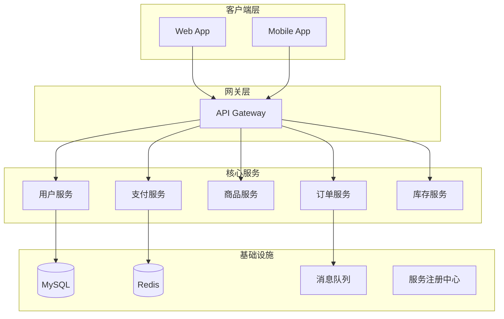

# Diagram Generator

将自然语言描述转化为专业图表的 Mermaid/PlantUML 代码。

## 快速参考

| 主题 | 说明 |
|------|------|
| 输入 | 自然语言描述（"画一个电商系统架构图"） |
| 输出 | Mermaid 代码块（前端渲染）+ 可选 PNG/SVG |
| 工具 | mermaid-cli (mmdc), PlantUML, Graphviz |
| 支持图表 | Flowchart, Sequence, Class, ER, Gantt, Pie, Mindmap, Timeline, C4 |

## 支持的图表类型

| 图表类型 | Mermaid语法 | 适用场景 |
|---------|------------|---------|
| 流程图 (Flowchart) | `graph TD/LR` | 业务流程、决策树 |
| 时序图 (Sequence) | `sequenceDiagram` | API交互、微服务通信 |
| 类图 (Class) | `classDiagram` | 代码架构、OOP设计 |
| ER图 (ER Diagram) | `erDiagram` | 数据库设计 |
| 甘特图 (Gantt) | `gantt` | 项目计划、时间线 |
| 饼图 (Pie) | `pie` | 数据分布 |
| 思维导图 (Mindmap) | `mindmap` | 头脑风暴、知识结构 |
| 架构图 (C4/Graph) | `graph` / PlantUML C4 | 系统架构 |

## 工作流程

### Phase 1: 意图分析
1. 解析用户描述，提取主体、关系、结构
2. 选择最佳图表类型（优先级：Mermaid > PlantUML > Graphviz）

### Phase 2: 代码生成
```bash
# Mermaid 生成（前端可直接渲染）
echo 'graph TD
    A[Client] --> B[API Gateway]
    B --> C[Service A]
    B --> D[Service B]' > output.mmd

# 导出 PNG（需要 mermaid-cli）
mmdc -i output.mmd -o output.png -w 1200 -H 800 --backgroundColor white

# 导出 SVG
mmdc -i output.mmd -o output.svg -w 1200 -H 800
```

### Phase 3: 输出交付
- **首选**: 输出 Mermaid 代码块，由前端 MermaidBlock 组件渲染
- **备选**: 调用 mmdc 导出 PNG/SVG 文件
- **多图**: 一次对话可生成多个图表

## 核心规则

### 1. Mermaid 优先原则
```
Mermaid代码块 → 前端原生渲染 → 零额外依赖
mmdc PNG/SVG  → 需要时导出    → 静态文件交付
PlantUML     → Mermaid不支持的复杂场景
```

### 2. 图表质量标准
- 节点数 ≤ 20（保持可读性）
- 使用中文标签（用户面向）
- 合理的层级深度（≤ 4层）
- 颜色区分关键路径

### 3. 安全限制
- 不执行用户提供的任意脚本
- 限制渲染资源（超时30s，内存512MB）
- 输入长度限制 10000 字符

## 示例

### 输入: "画一个电商微服务架构图"


## 依赖安装

```bash
# mermaid-cli（一键安装，包含 puppeteer）
npm install -g @mermaid-js/mermaid-cli

# 或通过 npx 免安装使用
npx @mermaid-js/mermaid-cli mmdc -i input.mmd -o output.png
```

## 前端集成说明
CrabPaw GUI 已有 `MermaidBlock` 组件位于 `gui/src/components/MarkdownRenderers/index.tsx`，
直接输出 Mermaid 代码块即可在前端渲染。仅在需要独立文件交付时使用 mmdc。
